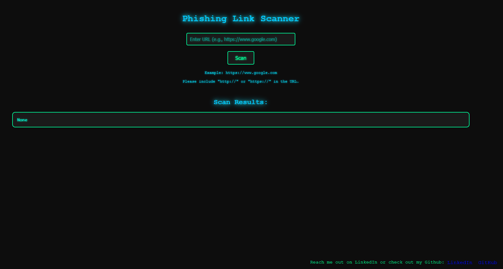
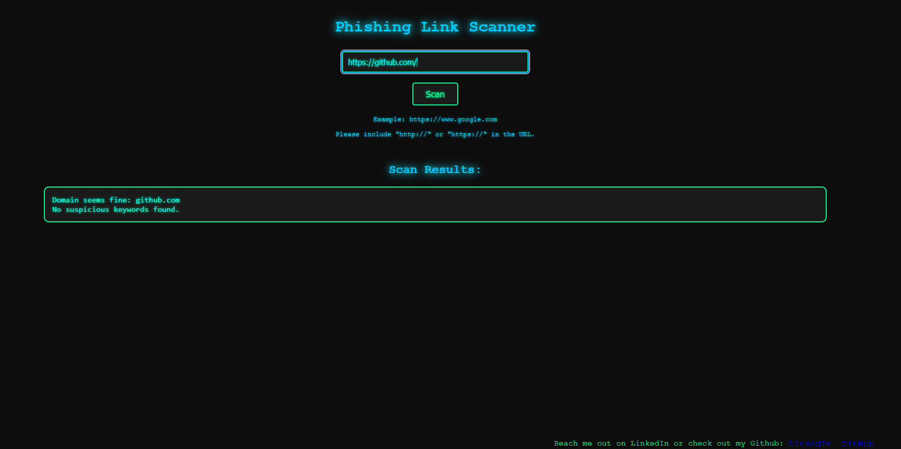
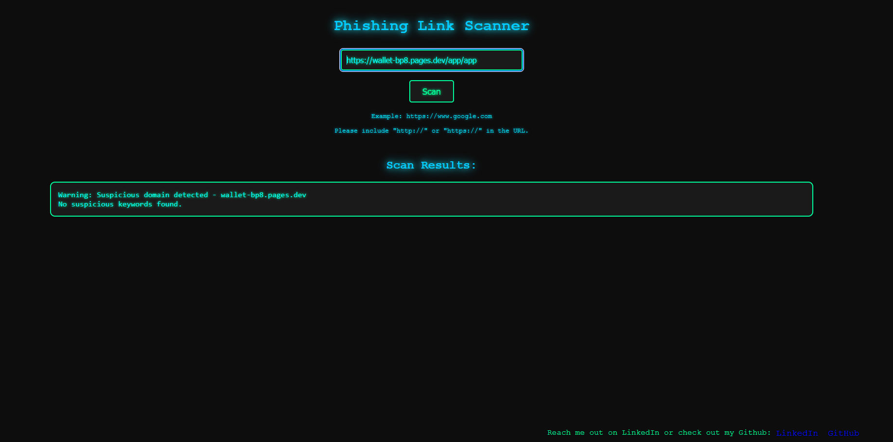

 # Phishing Link Scanner

A simple yet effective phishing link scanner built with Python and Flask. This tool provides a web-based interface for users to check if a URL might be a phishing attempt. The application uses a custom phishing detection algorithm and features a modern neon-themed design.

## Features

- **Web Interface**: Enter URLs through an easy-to-use web form.
- **Instant Analysis**: Real-time detection and results.
- **Neon-Themed Design**: A sleek, cyber-inspired look with dark mode and neon accents.
- **Customizable**: Easy to adapt and extend the detection algorithms.


## Installation

To get started with the Phishing Link Scanner, follow these steps:

1. **Clone the Repository**

   ```bash
   git clone https://github.com/USERNAME/REPOSITORY_NAME.git
   cd REPOSITORY_NAME
   ```
## Set up environemnt (Optional but recommended)

   ```bash
      python -m venv venv
      source venv/bin/activate # On Windows, use `venv\Scripts\activate
      pip install -r requirements.txt # Install dependencies
      python app.py # Run the Application
```


### Customization
- **Replace `USERNAME` and `REPOSITORY_NAME`**: Update with your GitHub username and repository name.
- **Screenshot**: Add a real screenshot link or remove the screenshot section if not applicable.
- **Contact Links**: Replace placeholders with your actual LinkedIn and Discord profiles.

This `README.md` provides a clear overview of your project, installation instructions, usage details, and contact information.

## Usage

- **Open the application in your web browser.
- **Enter the URL you want to check in the input field.
- **Click the "Scan" button.
- **Click the "Scan" button.
- **View the results below the form.

## Demo screenshots

Here’s how the application looks when running locally:


*Homepage*



*Scan Results Screenshot non sus link*



*Scan Results Screenshot sus link*

## Contributing

Contributions are welcome! If you have suggestions or improvements, please fork the repository and submit a pull request. You can also open an issue to discuss any bugs or feature requests.

## Acknowledgements

- **Flask: For the lightweight web framework.
- **Jinja2: For the templating engine.
- **Python: For the programming language.

## Contact

For any questions or inquiries, please contact me via:

- **LinkedIn**: [Your LinkedIn Profile](https://www.linkedin.com/in/muhammedpatel007/)

